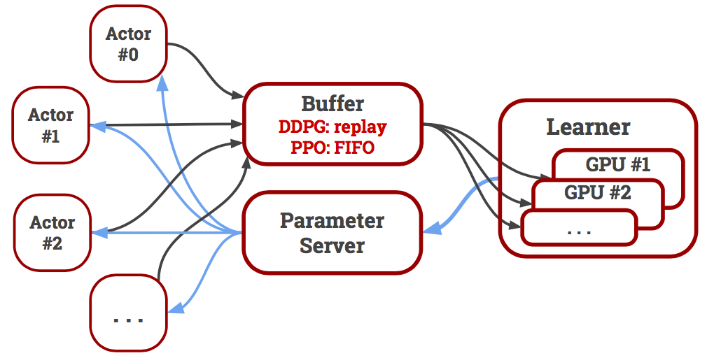
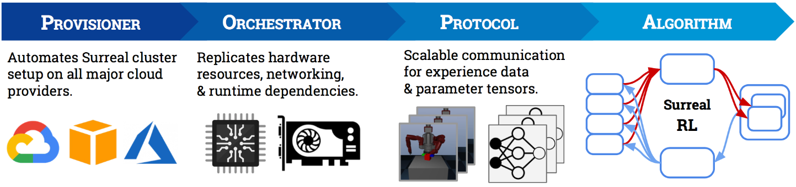
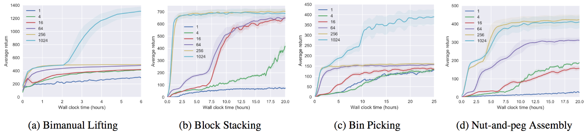
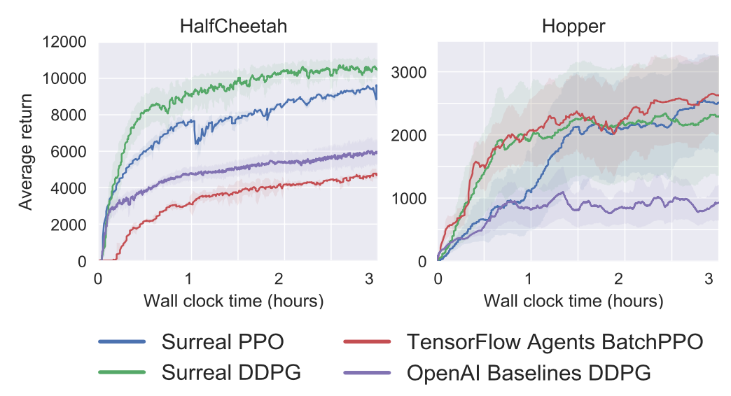

# **[SURREAL](https://surreal.stanford.edu)**
[About](#open-source-distributed-reinforcement-learning-framework)  
[Installation](#installation)  
[Benchmarking](#benchmarking)  
[Citation](#citation)  

## Open-Source Distributed Reinforcement Learning Framework

_Stanford Vision and Learning Lab_

[SURREAL](https://surreal.stanford.edu) is a fully integrated framework that runs state-of-the-art distributed reinforcement learning (RL) algorithms.


<div align="center">

</div>


- **Scalability**. RL algorithms are data hungry by nature. Even the simplest Atari games, like Breakout, typically requires up to a billion frames to learn a good solution. To accelerate training significantly, SURREAL parallelizes the environment simulation and learning. The system can easily scale to thousands of CPUs and hundreds of GPUs.


- **Flexibility**. SURREAL unifies distributed on-policy and off-policy learning into a single algorithmic formulation. The key is to separate experience generation from learning. Parallel actors generate massive amount of experience data, while a _single, centralized_ learner performs model updates. Each actor interacts with the environment independently, which allows them to diversify the exploration for hard long-horizon robotic tasks. They send the experiences to a centralized buffer, which can be instantiated as a FIFO queue for on-policy mode and replay memory for off-policy mode. 

<!---->

- **Reproducibility**. RL algorithms are notoriously hard to reproduce \[Henderson et al., 2017\], due to multiple sources of variations like algorithm implementation details, library dependencies, and hardware types. We address this by providing an _end-to-end integrated pipeline_ that replicates our full cluster hardware and software runtime setup.

<!---->

## Installation
Surreal algorithms can be deployed at various scales. It can run on a single laptop and solve easier locomotion tasks, or run on hundreds of machines to solve complex manipulation tasks.  
* [Surreal on your Laptop](docs/surreal_subproc.md)
* [Surreal on Google Cloud Kubenetes Engine](docs/surreal_kube_gke.md)   
* [Customizing Surreal](docs/contributing.md)  
* [Documentation Index](docs/index.md)  

## Benchmarking

- Scalability of Surreal-PPO with up to 1024 actors on Surreal Robotics Suite.



- Training curves of 16 actors on OpenAI Gym tasks for 3 hours, compared to other baselines. 




## Citation
Please cite our CORL paper if you use this repository in your publications:

```
@inproceedings{corl2018surreal,
  title={SURREAL: Open-Source Reinforcement Learning Framework and Robot Manipulation Benchmark},
  author={Fan, Linxi and Zhu, Yuke and Zhu, Jiren and Liu, Zihua and Zeng, Orien and Gupta, Anchit and Creus-Costa, Joan and Savarese, Silvio and Fei-Fei, Li},
  booktitle={Conference on Robot Learning},
  year={2018}
}
```


