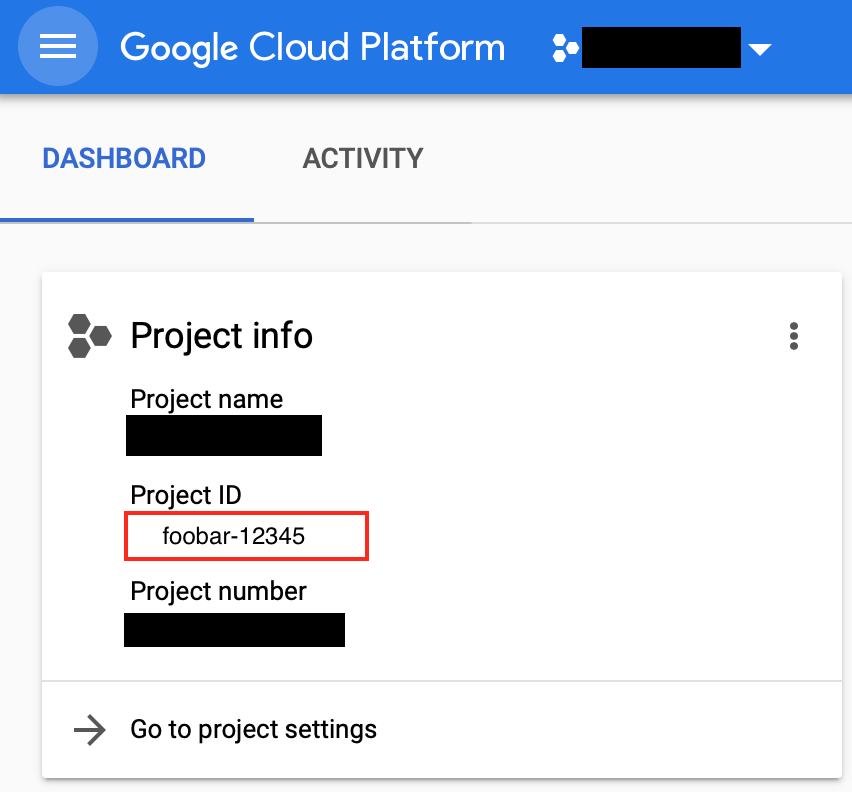
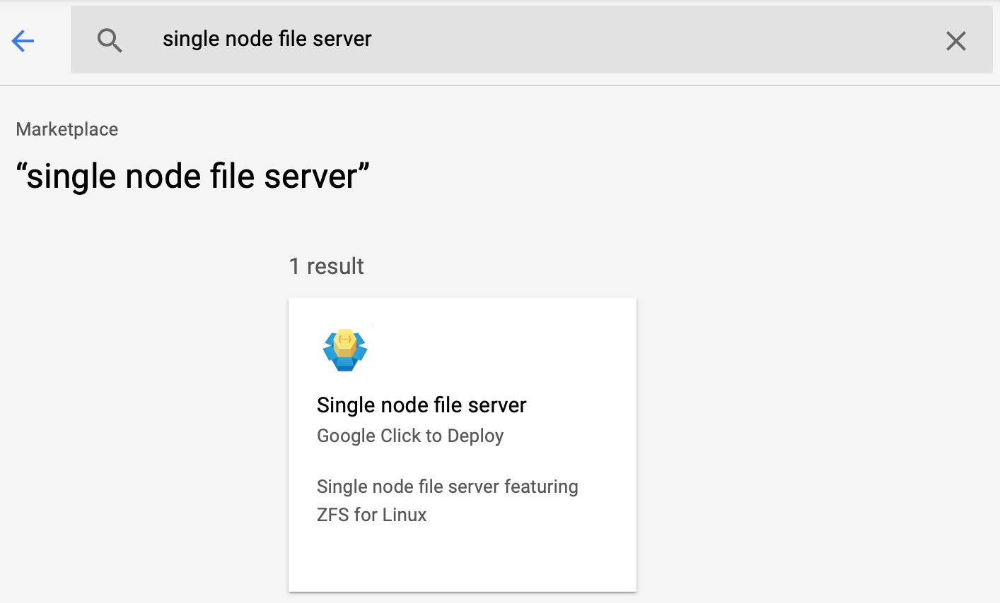
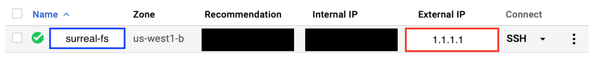

# Run SURREAL on Google Cloud Kubernetes Engine
To run large scale experiments, you need to setup Surreal on a Kubernetes Cluster. Here we provide a tutorial for how to do this using Google Cloud.

[Install Requirements](#install-requirements)  
[Create the Cluster](#create-the-cluster)  
[Configure Surreal](#configure-surreal)  
[Launch Experiments](#launch-experiments)  

## Install Requirements
1. **Install Surreal.** You must have surreal installed. Surreal supports python 3. We usually use python 3.5 and later.
```
pip install surreal
```

2. **Install Kubectl.** If you haven't heard about [Kubernetes](https://kubernetes.io), it would be helpful to look at some basic concepts. Surreal uses the `kubectl` commandline to interact with Kubernetes. So you need to install `kubectl` following [this guide](https://kubernetes.io/docs/tasks/tools/install-kubectl/).

3. **Install Terraform.** We use `terraform` to automate kubernetes cluster creation. Install `terraform` following instructions [here](https://www.terraform.io/intro/getting-started/install.html).

4. **Create Google Cloud Project.** We are using Google Cloud. You will need a [google cloud project](https://cloud.google.com/resource-manager/docs/creating-managing-projects) if you don't have a project, create one. You can find your project id at [console.cloud.google.com](console.cloud.google.com). See image.

<div align="center">

</div>

We need to install google cloud SDK. See [guide here](https://cloud.google.com/sdk/). After you successfully install, you can login to your google account using
```bash
gcloud auth login
```
Use your project id as default for `gcloud`
```bash
gcloud config set project <project -id>
```
Finally, expose the credentials to `terraform`.
```bash
gcloud auth application-default login
```

5. **Mujoco License.** To run Mujoco on a multi-node cluster, you will need a multi-machine license.

6. **Install Docker.** (Optional) If you want to customize surreal, you will need to use your own docker image. You can obtain docker [here](https://www.docker.com). If you have docker, you can use the following command to authenticate docker with you own google cloud container registry
```bash
gcloud auth configure-docker
```

## Create the Cluster
We use [Cloudwise](https://github.com/SurrealAI/cloudwise) to generate cluster definition and then use `terraform` to excecute the actual operations.

1. **Install Cloudwise.** Cloudwise is installed with surreal. If you cannot find the executable used, you can install cloudwise by running
```bash
pip install cloudwise
```

2. **Define the Cluster.** Make an empty directory, and run the cloudwise command for google cloud
```
mkdir surreal-kube
cd surreal-kube
cloudwise-gke
```
    - You will first be asked to provide your project id. 
    - Next cloudwise will ask for authentication json. Press `Enter` to skip since we have already done `gcloud auth login`.
    - Configure the zone that your cluster is going to be in, e.g. `us-west1-b`.
    - Name your cluster. We usually use `surreal-kube`.
    - Cloudwise will then ask you to create the default node pool. You can use the default settings (`20` and `n1-standard-2`).
    - Use `no` (default) when asked about preemptible machines.
    - Cloudwise will then ask you to setup the machines for your cluster. For surreal, you can use one of the four pre-defined combinations.
```bash
> combo 0 
# Anything among 0, 1, 2, 3 depending how big you want the cluster to be
# See commandline prompt for details
> done
```
    - You can use any save file name you want.

3. **Obtain Cluster Definition.** Cloudwise will generate the `<filename>.tf.json` file. This is the definition file for your Kubernetes cluster. Keep track of its location (we shall refer to it as `<cluster_definition_file>`) as we need the generated settings to schedule jobs on the cluster.

4. **Create the Cluster.** We shall create the Kubernetes cluster using `terraform`. First, run
```bash
terraform init
terraform plan
```
This will tell you what resources will be created. If nothing looks wrong, run
```bash
terraform apply
```
and type `yes` to confirm the operation. Terraform will then create your kubernetes cluster for you. This operation can take from 20 minutes to an hour depending on how complex your cluster is. Because these clusters have autoscaling enabled, it will initially have only three `n1-standard-2` machienes. Large instances and GPU will scale up and incur cost only when you need them. 

5. **Install GPU Drivers.** If some machines in your cluster has GPUs, you need create the daemon set to install drivers. This is done by running the following command. See [documentation](https://cloud.google.com/kubernetes-engine/docs/how-to/gpus#installing_drivers) for details. 
```bash
kubectl apply -f https://raw.githubusercontent.com/GoogleCloudPlatform/container-engine-accelerators/stable/nvidia-driver-installer/cos/daemonset-preloaded.yaml
```

6. **Create a Network File System.** (Optional, recommended) Create a shared network file system. This allows you to store experiment outputs in a centralized location. The general guide for file servers on Google Cloud is [here](https://cloud.google.com/solutions/filers-on-compute-engine). We used a single node file server, [documentation here](https://cloud.google.com/solutions/filers-on-compute-engine#single-node-file-server). To set it up:
    - Go to google cloud [console](https://console.cloud.google.com). And then search for Marketplace. 
<div align="center">

</div>
    - Select single node file server.
<div align="center">

</div>
    - Click "Launch on Compute Engine"
    - The default settings are in general fine. Make sure that the `zone` attribute should match your the zone that your cluster is in. We usually set the `Instance name` field to be `surreal-fs`.
    - Wait for the deployment. After it finishes, you have a network file system. The data are stored on the `/data` directory in the machine running the file server.
    - Now you can go to the Compute engine tab. And search for your file system. For example, see below. The blue box is the instance name. Machines on google cloud can use instance name to find this file server. The red box is the external ip. You can setup ssh into this machine using the externel ip (see [documentations](https://cloud.google.com/compute/docs/instances/connecting-advanced#provide-key) for how to configure it).  
<div align="center">

</div>
To configure Surreal to utilize the file system, there are several attributes that needs to be provided in a yaml dictionary. They will be needed later. 
    - First, we need to mount this file system onto each container running our experiments. `servername` is used by nodes on google cloud to locate the file server. Use the instance name of internal id of the server. `fs_location` specifies where is the file system on the server. This is by default `/data`. `/mount_path` is where the file system is mounted on the containers. For exmaple, if we mount the file system to `/fs` and save outputs to `/fs/experiments/foobar`, the data would reside on the file server.
```yaml
# experiment outputs are saved to /fs/experiments/foobar
nfs:
  servername: surreal-fs # or internal ip 
  fs_location: /data
  mount_path: /fs
  ...
```
    - To retrieve data from the ssh server, the location where experiment data is stored *on the server* needs to be provided. In our sample, it is at `/data/experiments/foobar`
```yaml
nfs:
    ...
    results_folder: /data/experiments/foobar
```

### Set up Kube on your own

You can set up a custom Kubernetes cluster if you want to deploy SURREAL on your own network-connected machines instead of Google Cloud.

Here is the official tutorial: https://kubernetes.io/docs/setup/scratch/

## Configure Surreal
You need to configure surreal properly to run experiments. If you have setup surreal to run locally using tmux, you may have already setup some fields. If you haven't, run 
```bash
surreal-default-config
```
Now go to `~/.surreal.yml` (or the location you specify by `SURREAL_CONFIG_PATH`) and fill in the required fields.

1. Set your preferred username in the `username: ` field. 
```yaml
username: foobar
```
Your username is prepended in front of every experiment to avoid naming conflict when working with a team. You can turn this off optionally by setting 
```yaml
prefix_experiment_with_username: False
```

2. Ignore `tmux_preamble_cmds` and `tmux_results_folder`

3. When you run an experiment, some metadata is saved locally as reference. The location is specified by `kube_metadata_folder`. For example, to store experiment data in `~/surreal/kube/<experiment name>`, you can do the following
```yaml
kube_metadata_folder: ~/surreal/tmux/
```

4. When creating the cluster using cloudwise (step 3 of installation), you have obtained a `.tf.json` cluster definition file. You want to specify its path in `cluster_definition` to help our scheduling utilities to assign tasks properly.
```yaml
cluster_definition: ~/surreal/cluster.tf.json
```

5. Experiments are run on countainers. To collect their output, you can specify where they store the output in `kube_results_folder`. Note that this path is *inside the docker container*. For example, we usually mount our network file system in directory `/fs` of the container. We usually write our experiment outputs to `<mount_point>/experiments/<username>/<experiment_name>`. This is thus configured by 
```yaml
kube_results_folder: /fs/experiments/foobar
```

6. To run mujoco on kubernetes you need to put your license in every container's `~/.mujoco/mjkey.txt`. Every file under the `mount_secrets` field will be mounted to the `/etc/secrets` directory using Kubernetes Secrets. The entry point of the Surreal Docker container will copy `mjkey.txt` from `/etc/secrets` to `~/.mujoco` if it is present. You can tell `surreal-kube` to upload `mjkey.txt` as a secret by setting the following field.
```yaml
mount_secrets:
  - ~/.mujoco/mjkey.txt
```

7. (Optional) Because the storage on a container is ephemeral, it is recommended that you create a network file system and mount it onto every container of your experiment. If you followed the installation guide to setup an nfs, uncomment the nfs field and put in the corresponding values described by the installation guide.
```yaml
nfs:
    ...
```

8. There are certain aspects of experiments that differ. For example, you may want to schedule Gym locomotion environments on CPU nodes but use 4 GPUs for mujoco environments. `creation_settings` specify a list of templates that one can choose from. Several useful settings are already provided.
```yaml
creation_settings:
    cpu-gym:
        ...
    cpu-robosuite:
        ...
    k80-robosuite:
        ...
```
When creating an experiment, the template is selected as an argument to `surreal-kube`. The default ones are good for now, we will use them later. If you want more information about creation settings, check [the documentation](creation_settings.md).

## Launch Experiments
With everything setup. You can use the `surreal-kube` commandline to create the distributed experiment. The syntax for creating an experiment is 
```bash
surreal-kube create <creation_setting_name> <experiment_name> [--override-args] [-- [algorithm specific configs]]
```
Here `<creation_setting_name>` is the key of the settings template in `~/.surreal.yml`. For example, the default one is `cpu-gym`. Certain fields in the template can be changed by using `--override-args` (see [documentation](creation_settings) for details). Algorithm specific arguments, if present, are provided after `--`. They are parameters passed to specific algorithms. **TL;DR** For the time being, we only need the basic features.
```bash
surreal-kube create cpu-gym first-experiment
```
This will create an experiment using default settings. Use `surreal-kube p` (which stands for `surreal-kube list-processes`) to list all the processes.
```bash
surreal-kube p
> Group     Name         Ready  Restarts  State          
>           agents-0                      Pending
>           agents-1                      Pending
>           eval-0                        Pending
> nonagent  learner                       Pending
```
Initially, processes are shown to be pending because they are waiting to be launched. If you are starting from scratch, the cluster is now spinning up more machines to handle this experiment. In a while, the nodes should be running.
```bash
surreal-kube p
> Group     Name         Ready  Restarts  State          
>           agents-0     1      0         running: 10m
>           agents-1     1      0         running: 10m  
>           eval-0       1      0         running: 9m  
> nonagent  learner      1      0         running: 8m  
...
```
Now you can inspect the logs of every process separately.
```bash
surreal-kube logs learner
> 20:08:09 INFO> Initializing DDPG learner
> 20:08:09 INFO> Using GPU
> 20:08:09 INFO> cudnn version: 7102
> 20:08:09 INFO> Using hard target update every 500 steps
```
We write reward and performance statistics to a single tensorboard using [Tensorplex](https://github.com/SurrealAI/Tensorplex). The tensorboard is exposed as a service named `tensorboard` . The following command will open the tensorboard for you.
```bash
surreal-kube tensorboard
# Opens browser
```
You can access the containers using `surreal-kube ssh` and check CPU/GPU usage
```bash
surreal-kube ssh learner
root@nonagent:/mylibs# top # or e.g. nvidia-smi
```
Kubernetes allow us to run multiple experiments at once. This means we can create another experiment.
```bash
surreal-kube create cpu-mujoco second-experiment
```
Wait for the nodes to spin up and check out the nodes. To list all the experiments that you have, run `surreal-kube lse (list-experiments)`. 
```bash
surreal-kube lse
> foobar-first-experiment
> foobar-second-experiment
```
Since you just created the second experiment, you will see processes of the second experiments when you run `surreal-kube p`. You can see which experiment you are currently on and change it with `surreal-kube se` (`surreal-kube switch-experiments`). 
```bash
surreal-kube se
> foobar-second-experiment
surreal-kube se foobar-first-experiment
surreal-kube se
> foobar-first-experiment
```
If you have nfs setup properly, you can retrieve data using the following commands
```bash
surreal-kube get-video foobar-first-experiment
> Downloading ...
surreal-kube get-config foobar-first-experiment
> Downloading ...
surreal-kube get-tensorboard foobar-second-experiment
> Downloading ...
```
After you are done, delete the experiment.
```bash
surreal-kube delete
```

For more information about `surreal-kube`, see [surreal-kube documentation](kurreal.md). It will also detail how to create experiments with more customization.
